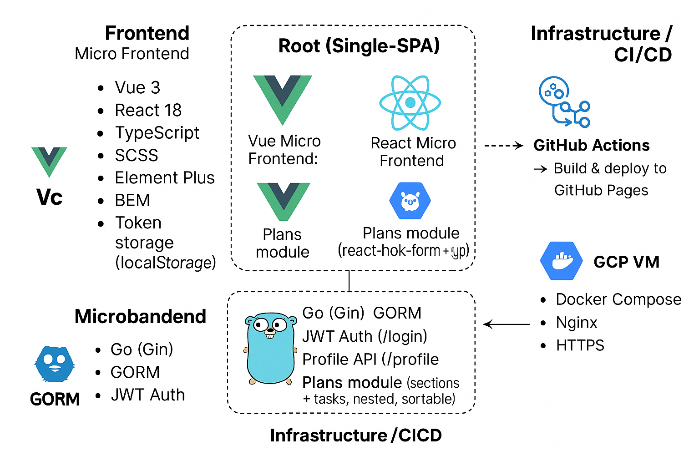

# 🧩 Micro Frontend + Go Backend 全端架構總覽

本專案採用微前端架構（Micro Frontends）結合 Go (Gin) 後端 API，支援登入/註冊、巢狀任務管理（Plans module）與自動化部署流程，完整涵蓋從前端到後端的模組化開發模式與 CI/CD。

---

## 🔹 Frontend - Micro Frontends

| 子應用              | 技術堆疊                              | 說明                                   |
| ------------------- | ------------------------------------- | -------------------------------------- |
| `@vue-micro/root`   | Single-SPA                            | 微前端主容器，整合所有子應用           |
| `@vue-micro/navbar` | Vue 3, Vue CLI                        | 導覽列應用                             |
| `@vue-micro/sub`    | Vue 3, TypeScript, vue-draggable-plus | Plans module，支援巢狀 task 結構與排序 |
| `@vue-micro/auth`   | React 18, react-hook-form, yup        | 登入與註冊模組                         |

📌 共用特性：BEM 命名、SCSS、Element Plus（Vue）、Material UI（React）、JWT 儲存在 localStorage

---

## 🔹 Backend - Micro Backend（Go + Gin）

- 使用 [Gin](https://gin-gonic.com/) 建構 RESTful API
- 資料庫：MySQL + GORM + golang-migrate
- JWT 認證與登入/註冊機制
- 模組：
  - `/auth/login`、`/auth/register`
  - `/profile`
  - `/sections`、`/tasks`：CRUD + 巢狀結構 + `sort_order` 排序
  - 支援 user_id 綁定過濾資料

---

## 🔹 Infrastructure / CI/CD

| 環境     | 技術                                     | 描述                               |
| -------- | ---------------------------------------- | ---------------------------------- |
| Frontend | GitHub Actions + GitHub Pages            | 各子應用自動部署至 Pages           |
| Backend  | GitHub Actions + GCP VM (Compute Engine) | SSH 進行部署 + Docker Compose 啟動 |
| 其他     | Nginx + Certbot                          | 反向代理 + HTTPS 憑證自動續期      |

---

## 🧠 架構設計亮點

- ✅ 採用微前端提升模組可維護性與獨立部署能力
- ✅ 子應用技術自由（Vue/React 共存）
- ✅ 後端支援巢狀資料結構、排序、自動綁定使用者
- ✅ CI/CD 全自動部署整合 GitHub Actions + GCP

---
